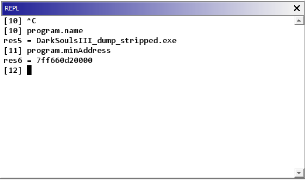

# Ghidra-Kotlin-Script

Extending the Ghidra reverse engineering framework with support for the Kotlin programming language.

## Usage

### Writing Kotlin Scripts

Ghidra-Kotlin-Script registers a new scripting provider inside Ghidra that can be used to write scripts in the Kotlin
programming language.
To create a script, simply create a Kotlin file with an extension of `ghidra.kts` in a user script folder.

The entire API available to Kotlin scripts can be seen here:

```kotlin
interface KotlinScriptAPI {
    var currentFunction: Function
    var currentHighlight: ProgramSelection
    var currentLocation: ProgramLocation
    var currentSelection: ProgramSelection
    val program: Program
}
```

### Using the REPL

The REPL is only accessible after configuring it within the Code Browser tool.
Use the `File` -> `Configure` menu to enable the KotlinScriptReplPlugin found under the `Miscellaneous` section.

After enabling, a new tool window is available to use as an interpreter with the same scripting API.

